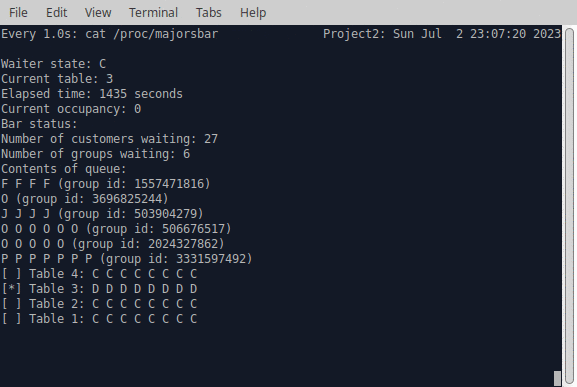

# Bar-Waiter-Kernel-Module
This kernel module simulates a bar and its waiter. This bar is on campus and students and professors visit it. It works by utilizing custom system calls that need to be correctly compiled in the kernel. The waiter implements a round-table-like algorithm that prioritizes certain actions based on certain states of the table. The waiter loads groups to a table based on their position in the customer queue. A table must be clean in order for the waiter to load a group to it. This project was for a grade and was constructed by the following students:
* Carlos Pantoja-Malaga
* Stanley Vossler
* Matthew Echenique
### Waiter States
| Waiter States | Meaning  |
|--------------|----------|
| I            | Idle     |
| L            | Loading  |
| C            | Cleaning |
| M            | Moving   |

* Idle: The waiting is idling, it has no tables to clean, and there are no customers waiting to be served.
* Loading: The waiter is moving customers to or off a table.
* Cleaning: The waiter is currently cleaning a table.
* Moving: The waiter is moving to another table.

### Table States
| Table States | Meaning            |
|--------------|--------------------|
| C            | Clean              |
| D            | Dirty              |
| F            | Freshman in seat   |
| O            | Sophomore in seat  |
| J            | Junior in seat     |
| S            | Senior in seat     |
| P            | Professor in seat  |

## Project Setup
1. Clone into the github repo and type `make`. 
2. Make sure that system calls intialize_bar, customer_arrival, and close_bar are defined in `(KERNELDIR)/arch/x86/entry/syscall/syscall_64.tbl` as labels 548, 549, and 550 - respectively. 
3. Make sure the system calls are also defined in `(KERNELDIR)/include/linux/syscalls.h`. 
4. In the `/lib/modules/5.15.102/build/Makefile` make sure the directory where all the source files is defined like so, `core-y += kernel/ certs/ mm/ fs/ ipc/ security/ crypto/ (DIRECTORYNAME)/`. 
5. Recompile the kernel after confirming all of the changed are made correctly, if they are not the kernel will not compile with our module. 
6. After that install the kernel module, `sudo insmod barstool.ko`, and then use the consumer `./c.x --start` to invoke the initialize_bar system call. 
7. Use the producer to add customers to the bar `./p.x (NUM)`. 
8. Finally you can watch the simulator playout by using the following command `watch -n 1 cat /proc/majorsbar` 

## Bar-Waiter Demo

